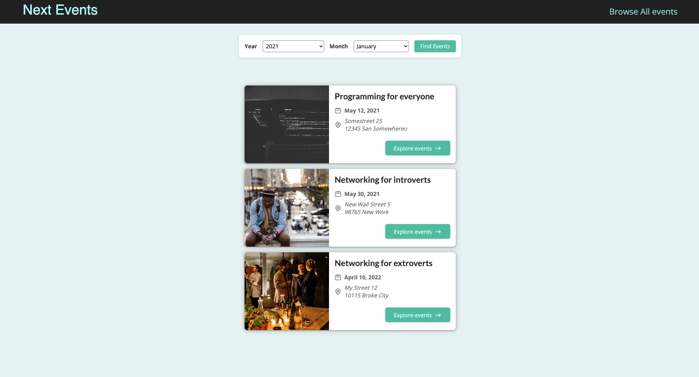

This is a [Next.js](https://nextjs.org/) project bootstrapped with [`create-next-app`].

## Getting Started

First, run the development server:

```bash
npm run dev
# or
yarn dev
```

Open [http://localhost:3000](http://localhost:3000) with your browser to see the result.

This simple project demonstrates all the possibility of file based routing of Next js. 

***

## Home page



## Catch all route page.

this page will be displayed when filter is set and query will look like so

`http://localhost:3000/events/2021/5`


## Dynaimc page with id


